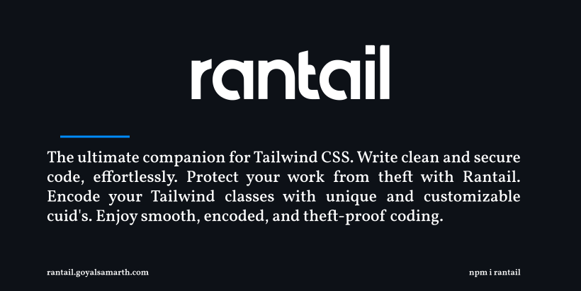

[](rantail.goyalsamarth.com)

<div align="center">

[](https://badge.fury.io/js/rantail) 
[](https://github.com/igoyalsamarth/rantail/pulls)
<a href="https://twitter.com/intent/follow?screen_name=igoyalsamarth">

</a>

</div>

## Table of contents

- [Getting started](#getting-started)
  - [Installation](#installation)
  - [Create config file](#create-config-file)
    - [Custom config file](#custom-config-file)
- [Configuration Options](#configuration-options)
- [Full configuration example](#full-configuration-example)
- [Typescript JSDoc](#typescript-jsdoc)
- [Important Information](#important-information)

## Getting started

### Installation

```shell
npm install rantail
```

### Create config file

`rantail` requires a basic config file (`rantail.config.js`) under your project root

```js
/** @type {import('rantail').IConfig} */
const config = {
    content: [
        './pages/**/*.{js,jsx}',
        './components/**/*.{js,jsx}',
        './app/**/*.{js,jsx}',
        './src/**/*.{js,jsx}',
    ],
    cssFilePath:'src/index.css',
    // ...other options
}
export default config
```
### Configuring Rantail

Add `rantail` as your prebuild script

```json
{
    "prebuild": "rantail",
    "build": "next build"
}
```

#### Custom config file

You can also use a custom config file instead of `rantail.config.js`. Just pass `--config <your-config-file>.js` to build command (Example: [custom-config-file](https://github.com/igoyalsamarth/rantail/tree/master/examples/custom-config-file))

```json
{
  "prebuild": "rantail --config awesome.config.js",
  "build": "next build"
}
```

## Configuration Options

| property                                            | description                                                                                                                                                                                                                                                                                                                                                                                                                          | type                                                                                                                     |
| --------------------------------------------------- | ------------------------------------------------------------------------------------------------------------------------------------------------------------------------------------------------------------------------------------------------------------------------------------------------------------------------------------------------------------------------------------------------------------------------------------ | ------------------------------------------------------------------------------------------------------------------------ |
| content                                             | The files for which conversion is required. Default ```['./pages/**/*.{js,jsx}', './components/**/*.{js,jsx}', './app/**/*.{js,jsx}', './src/**/*.{js,jsx}']```                                                                                                                                                                                                                                                                                                                                                                                                            | array of glob patterns                                                                                                                   |
cssFilePath|Path from root where main CSS file is located.                                    | string                                                                                                                                                                                                                                                                                                                                                                                                                      |
| cuidLength (optional)                               | Length of the cuid's generated. Default `12`. Visit [cuid2's docs](https://github.com/paralleldrive/cuid2) for collision rate calculation.                                                                                                                                                                                                                                                                                                                                                                                                   | number                                                                                                                   |
| suffix (optional)                                 | Suffix to generated cuid's.                                                                                                                                                                                                                                                                                                                                                                                                              | string                                                                                                                   |
| prefix (optional)                      | Prefix to generated cuid's                                                                                                                                                                                                                                                                                                                                                | string                                                                                                                   |
| ignore (optional)                            | classNames starting with variable to be ignored when converting tailwind functions to cuid's                                                                                                                                                                                                                                                                                                                                                                       |       string|

## Full configuration example

Here's an example `rantail.config.js` configuration with all options

```js
/** @type {import('rantail').IConfig} */

const config = {
    content: [
        './pages/**/*.{js,jsx}',
        './components/**/*.{js,jsx}',
        './app/**/*.{js,jsx}',
        './src/**/*.{js,jsx}',
    ],
    cssFilePath:'src/index.css',
    cuidLength: 5,
    suffix: '_',
    prefix: '_',
    ignore: '_'
}

export default config
```

Above configuration will convert the below `.jsx` file

```js
import { useState } from "react";

function App() {
  const [number, setNumber] = useState(0)

  return (
    <div>
      <p className="text-3xl font-black _doNotConvert">test2</p>
      <div className={`text-sm font-black`}>test-3</div>
      <button onClick={() => setNumber(number + 1)} className={`border-[5px] border-yellow-500 rounded-lg ${number % 2 === 0 ? 'bg-orange-500 font-bold' : 'bg-blue-500 font-black'} `}>Press Me</button>
    </div>
  )
}

export default App;
```
into `.jsx` which will look like

```js
import { useState } from "react";

function App() {
  const [number, setNumber] = useState(0)

  return (
    <div>
      <p className="_wat19_ _yvrrd_ _doNotConvert">test2</p>
      <div className={`_s28yg_ _yvrrd_`}>test-3</div>
      <button onClick={() => setNumber(number + 1)} className={`_txcx1_ _l9g84_ _z5uso_ ${number % 2 === 0 ? '_mebu4_ _pv8la_' : '_l9hdm_ _yvrrd_'} `}>Press Me</button>
    </div>
  )
}

export default App;
```

along with appending those values to the `.css` file to make it look like 

```css
@tailwind base;
@tailwind components;
@tailwind utilities;
._wat19_ { @apply text-3xl; }
._yvrrd_ { @apply font-black; }
._s28yg_ { @apply text-sm; }
._txcx1_ { @apply border-[5px]; }
._l9g84_ { @apply border-yellow-500; }
._z5uso_ { @apply rounded-lg; }
._mebu4_ { @apply bg-orange-500; }
._pv8la_ { @apply font-bold; }
._l9hdm_ { @apply bg-blue-500; }
._tpvzj_ { @apply flex; }
._ek8mx_ { @apply w-[500px]; }
```

## Typescript JSDoc

Add the following line of code in your `rantail.config.js` for nice typescript autocomplete! 💖

```js
/** @type {import('rantail').IConfig} */
module.exports = {
  // YOUR CONFIG
}
```

## Important Information

Rantil is a pre-build feature that performs the conversion in your development code before the build process. When using it, exercise caution if you attempt to build it without a code copy. It is advisable to utilize hosting providers such as `Vercel`, `Netlify`, or `Cloudflare Pages`, etc, which build a copy of your code.


## Contribution

All PRs are welcome :)
